# Coordinate system definition

For the calculation of the mirror position we use Cartesian and Spherical coordinates.

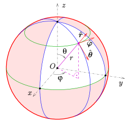

Source: https://en.wikipedia.org/wiki/File:Kugelkoord-lokb-e.svg

Our Cartesian coordinate system is placed in the following way:
- x-axis looks from the Orb to the user
- y-axis looks to the left from the Orb's perspective
- z-axis looks into the sky

In the Spherical coordinate system the following applies:
- Rotating the mirror in the positive phi direction makes the IR eye camera look more to the left.
- Rotating the mirror in the positive theta direction makes the IR eye camera look downwards.
- Because we are interested in the direction only, we scale our r-value to 1 because it makes the transformations easier.

# Eye position in RGB image

The origin of the RGB image is in the top left corner as shown in the following drawing:

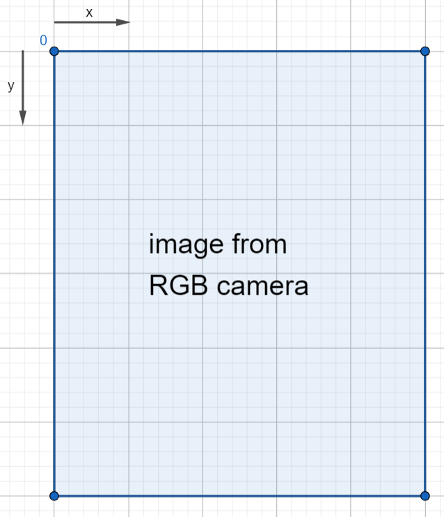

For each eye we get a x and y coordinate in this format.

## Fisheye correction

Because of our RGB camera lens, our image is distorted, which means that the size of the pixels is not constant. This can be observed in the following image which was taken at a distance of 135 mm between the RGB camera and the center of the paper (coordinate 0/0). The distance of the small grid lines is 5 mm and the blue grid lines mark 50 mm distances:

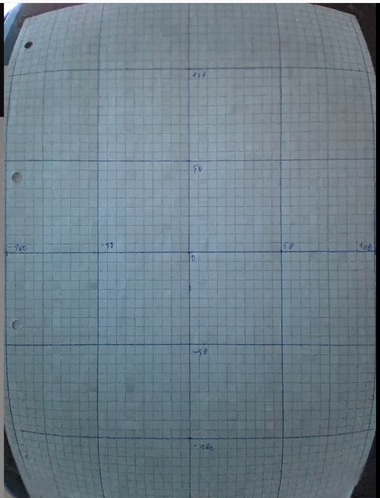

The fisheye correction takes this into account and generates a new (x, y) coordinate in a fixed pixel size image which we can then use for calculating the real spacial position.

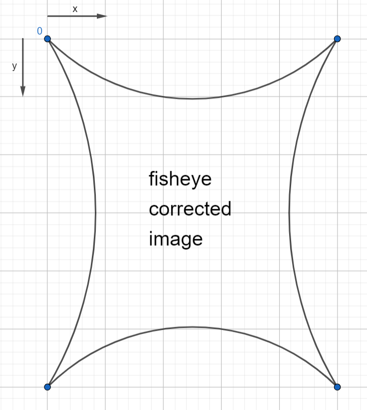

## RGB camera view angles

From the photo of the previous section we can calculate the view angles (from the center point) of the RGB camera.

RGB_CAMERA_VIEW_ANGLE_HORIZONTAL_DEGREES $= \arctan(\frac{100 mm}{135 mm}) * 2 = 73°$

RGB_CAMERA_VIEW_ANGLE_VERTICAL_DEGREES $= \arctan(\frac{275 mm / 2}{135 mm}) * 2 = 91°$

Because of the fisheye effect these viewing angles are only valid on the center lines of the RGB image. They are marked as "horizontal" and "vertical" in the following drawing:

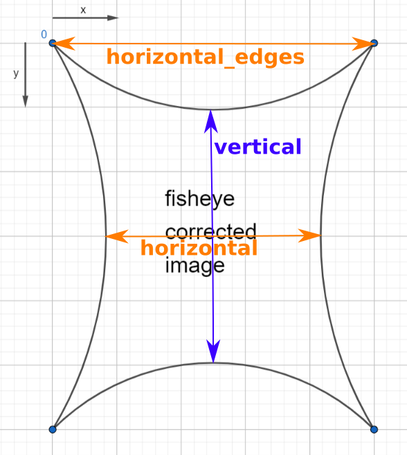

To get the view angles which are valid at the edges of the image (marked as "horizontal_edges") you need to scale those values. This is done in eye_tracker.rs by the following two lines:

```
RGB_CAMERA_VIEW_ANGLE_HORIZONTAL_DEGREES / self.horizontal_multiplier
RGB_CAMERA_VIEW_ANGLE_VERTICAL_DEGREES / self.vertical_multiplier
```

# Calculation of target gimbal viewing angles from eye positions

From our fisheye corrected eye pixel coordinates we want to calculate the target viewing direction of our gimbal (which equals the viewing direction of the IR eye camera).

## Gimbal phi angle calculation

The following drawing shows an intersection of the Orb from the top-side view where all $z$ coordinates are $0$.

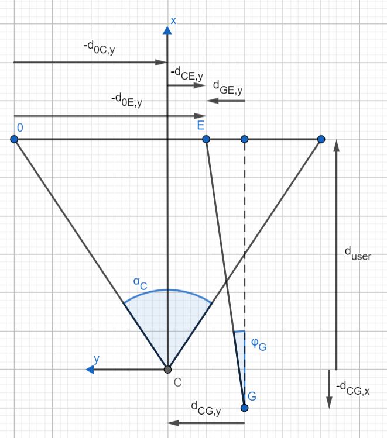

- $C$ is the center of the RGB camera
- $G$ is the center of the gimbal (the center of the mirror)
- $E$ is the position of the user's eye
- $d_{CG,y}$ describes the distance between the RGB camera and the gimbal in y-direction
- $d_{CG,x}$ describes the distance between the RGB camera and the gimbal in x-direction
- $\alpha_C$ is the horizontal viewing angle of the RGB camera
- $\phi_G$ is our target gimbal angle
- $d_{0E,y}$ is the distance from the origin to the eye position in y-direction. This is our input coordinate $x$ from the RGB image.
- $d_user" is the distance of the user to the RGB camera

First of all we calculate the distance between the eye position $E$ and the RGB camera $C$ in y-direction:

$$
d_{CE,y} = d_{0E,y} - d_{0C,y}
$$

In this equation $d_{0C,y}$ is the distance between the center of the RGB image and the edge of the RGB image in y-direction at the user's distance $d_{user}$. We can calculate it from the camera's viewing angle $\alpha_C$ and $d_{user}$ by the following equation:

$$
d_{0C,y} = \tan(\frac{\alpha_C}{2}) * d_{user} 
$$

Now we can calculate the distance between the eye $E$ and the Gimbal $G$ in the y-direction:

$$
d_{GE,y} = d_{CG,y} - d_{CE_y} = d_{CG,y} - d_{0E,y} + \tan(\frac{\alpha_C}{2}) * d_{user} 
$$

After that we can calculate the gimbal angle $\phi_G$:

$$
\tan(\varphi_G) = \frac{d_{GE,y}}{d_{user} + d_{CG,x}}
$$

$$
\varphi_G = \arctan(\frac{d_{GE,y}}{d_{user} + d_{CG,x}})
$$

$$
\varphi_G = \arctan(\frac{d_{CG,y} - d_{0E,y} + \tan(\frac{\alpha_C}{2}) * d_{user} }{d_{user} + d_{CG,x}})
$$

## Gimbal theta angle calculation

Similarly, the following drawing shows an intersection of the Orb from the left-side view where all $y$ coordinates are $0$.

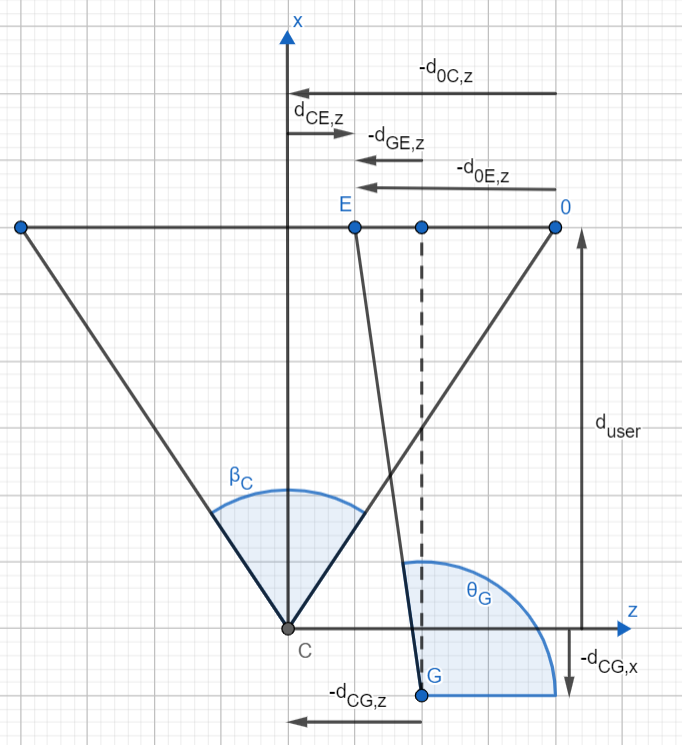

- $d_{CG,z}$ describes the distance between the RGB camera and the gimbal in z-direction
- $\beta_C$ is the vertical viewing angle of the RGB camera
- $\theta_G$ is our target gimbal angle
- $d_{0E,z}$ is the distance from the origin to the eye position in z-direction. This is our input coordinate $y$ from the RGB image.

$$
d_{CE,z} = - d_{0E,z} + d_{0C,z}
$$

$$
d_{0C,z} = \tan(\frac{\beta_C}{2}) * d_{user} 
$$

$$
d_{GE,z} = d_{CG,z} - d_{CE_z} = d_{CG,z} + d_{0E,z} - \tan(\frac{\beta_C}{2}) * d_{user} 
$$

$$
\tan(\theta_G - 90°) = \frac{d_{GE,z}}{d_{user} + d_{CG,x}}
$$

$$
\theta_G = 90° + \arctan(\frac{d_{GE,z}}{d_{user} + d_{CG,x}})
$$

$$
\theta_G = 90° + \arctan(\frac{d_{CG,z} + d_{0E,z} - \tan(\frac{\beta_C}{2}) * d_{user}}{d_{user} + d_{CG,x}})
$$

## Summary

$$
\varphi_G = \arctan(\frac{d_{CG,y} - d_{0E,y} + \tan(\frac{\alpha_C}{2}) * d_{user} }{d_{user} + d_{CG,x}})
$$

$$
\theta_G = 90° + \arctan(\frac{d_{CG,z} + d_{0E,z} - \tan(\frac{\beta_C}{2}) * d_{user}}{d_{user} + d_{CG,x}})
$$

## Mirror to RGB camera distances on Pearl and Diamond Orbs

For Pearl and Diamond we got the following values from our CAD program:

|            | Pearl        | Diamond (B3) |
| ---        | ---          |--------------|
| $d_{CG,x}$ | 27.4 mm      | 24.98 mm     |
| $d_{CG,y}$ | 8.2 mm       | 28.97 mm     |
| $d_{CG,z}$ | -44.39 mm    | -57.5 mm     |

<table>
<tr>
<th>Pearl</th><th>Diamond (B3)</th>
</tr>
<tr>
<td>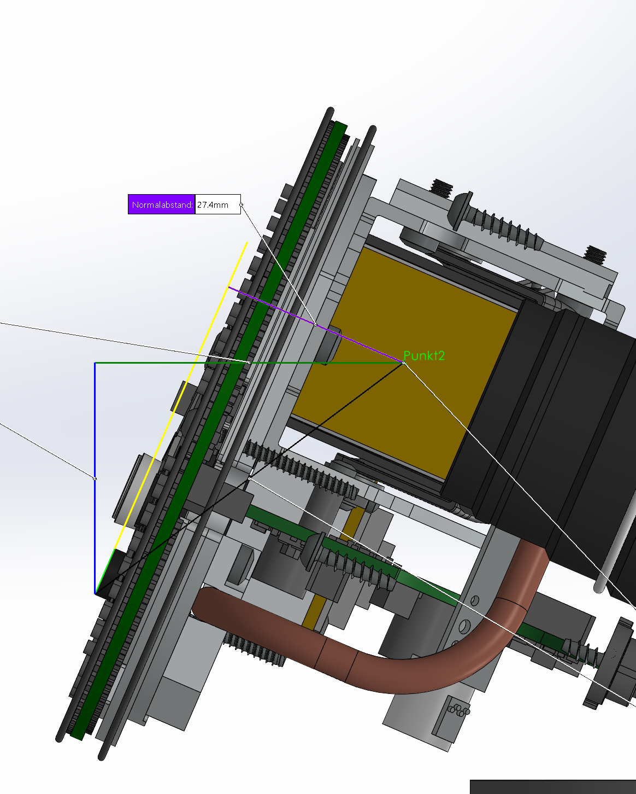</td><td>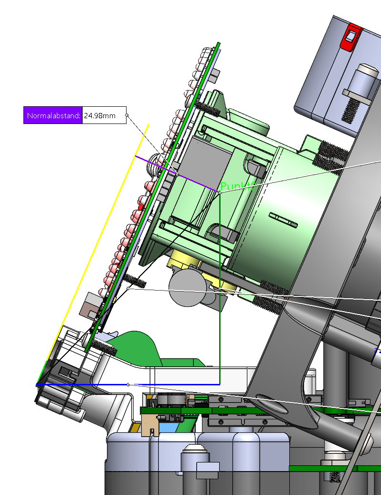</td>
</tr>
<tr>
<td>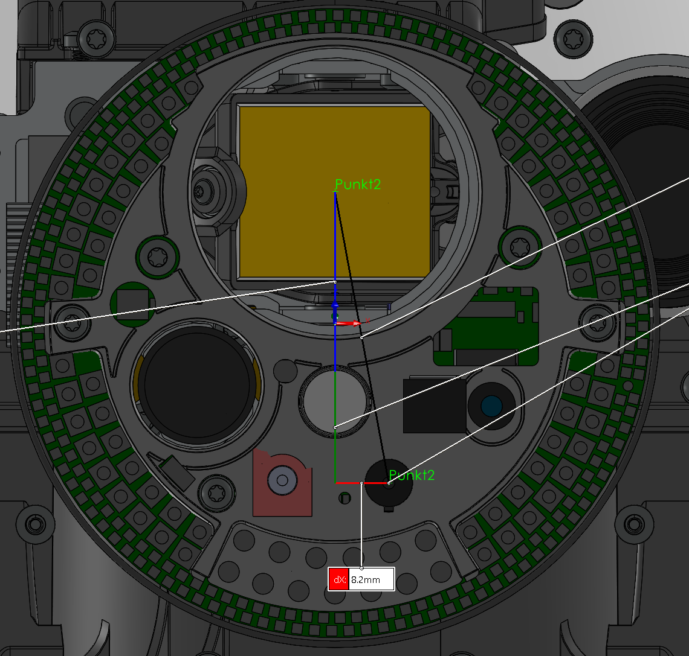</td><td>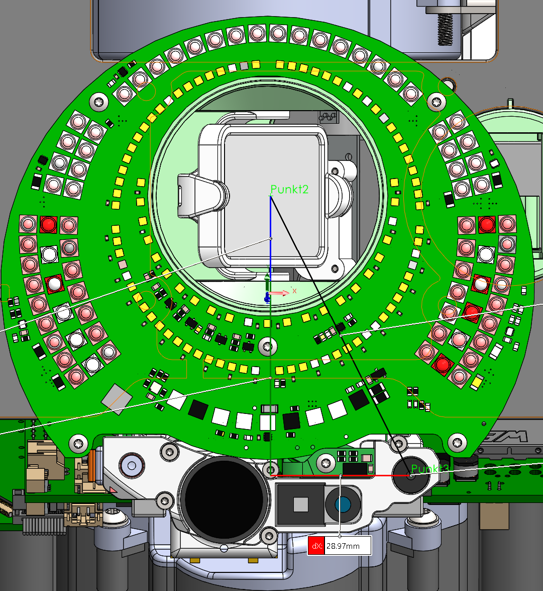</td>
</tr>
<tr>
<td>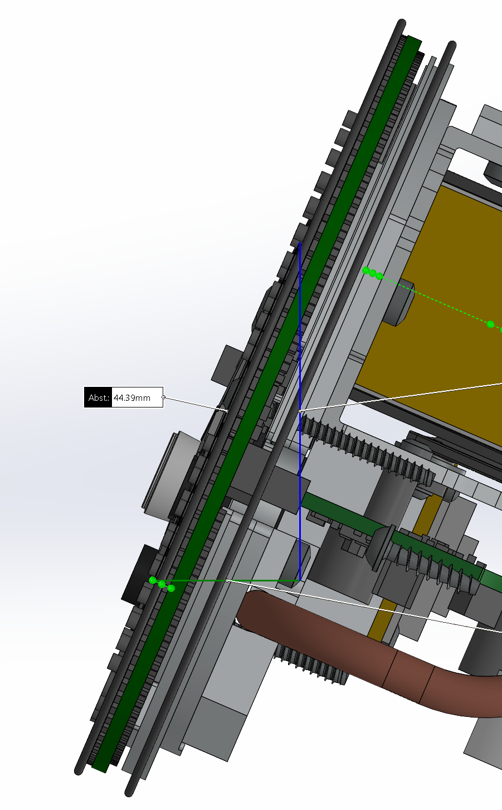</td><td>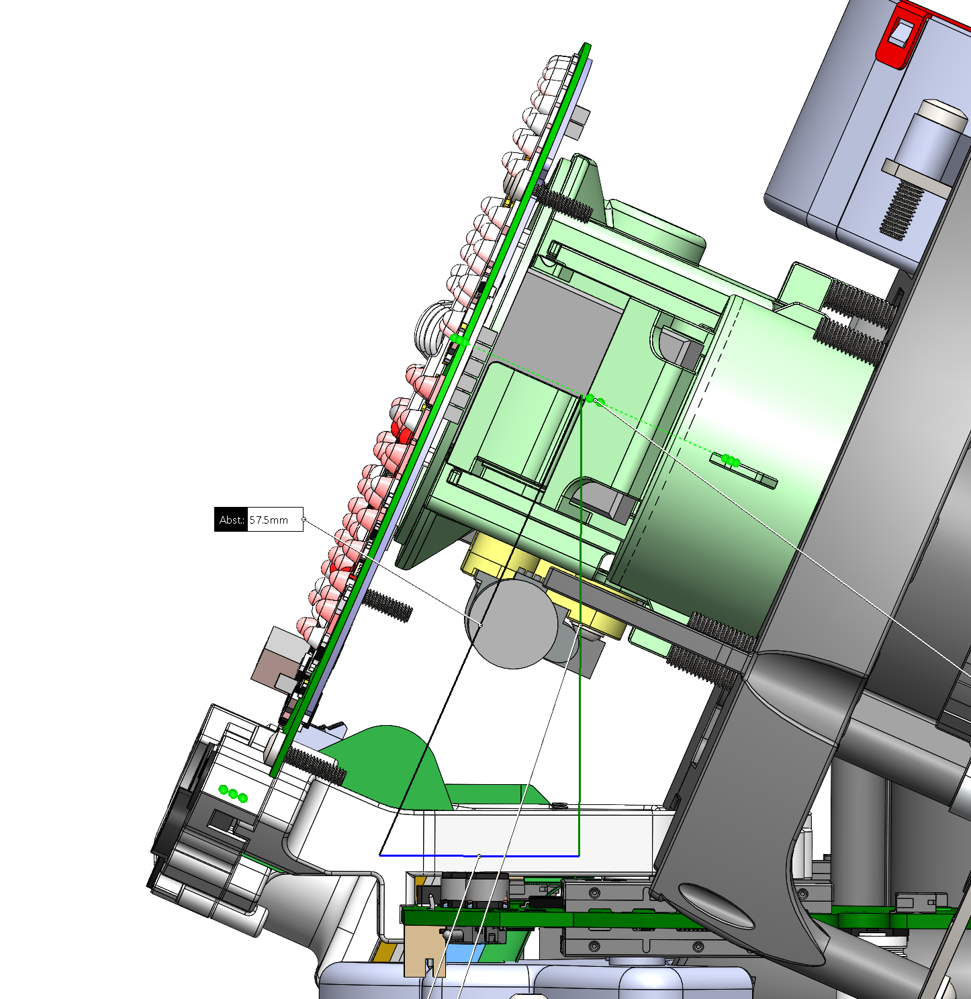</td>
</tr>
</table>

# Calculation of mirror angles from gimbal viewing angles

## Introduction

The intuitive solution which we used in older software versions is, that if you want to rotate the viewing direction by $\varphi$ degrees, you rotate the mirror by  $\varphi/2$ degrees. Unfortunatelly, the accurate solution is more complex and the intuitive solution works only for $\theta = 90°$ and rotation by $\varphi$.

The following drawing shows what happens if you apply different values for $\theta_M$ at the mirror. Each line represents the movement of the resulting gimbal view angle with a fixed $\varphi_M$ value on a plane which is placed in front of the Orb.

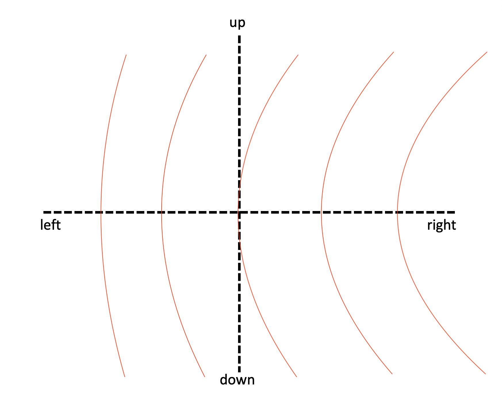

The solution is not to think in Spherical coordinates and mirror the $\theta$ and $\varphi$ values (which doesn't work so easily), but switch to Cartesian coordinates and do the mirror operation there.

## Mirror calculations

For calculation the mirror position we use the following vectors in Cartesian coordinates:
- $\vec{v_{in}}$: vector from mirror center to fixed 45° mirror
- $\vec{n}$: normal vector to mirror surface
- $\vec{v_{eye}}$: vector from mirror center to user's eye

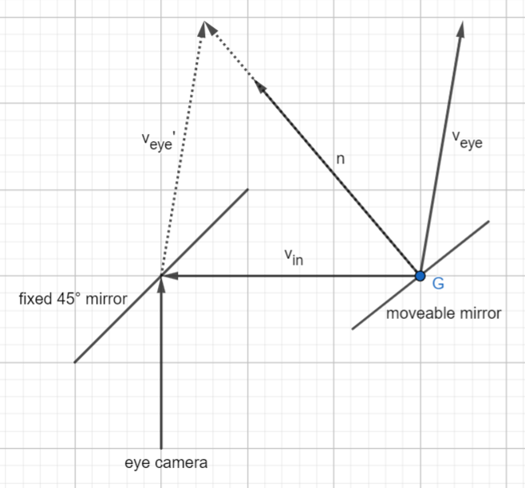

$\vec{v_{in}}$ is fixed with a value of: 

$$ \vec{v_{in}} = \begin{pmatrix} 
   0 \\
   1 \\
   0 \\
   \end{pmatrix} $$

$\vec{v_{eye}}$ is what we got from our previous calculations but we need to transform it from the Spherical coordinates into Cartesian coordinates by the following formulas:

$$ x = r * \sin(\theta) * \cos(\varphi) $$

$$ y = r * \sin(\theta) * \sin(\varphi) $$

$$ z = r * \cos(\theta) $$

In our case $r$ is $1$ and we get:

$$  \vec{v_{eye}} = 
    \begin{pmatrix} 
    \sin(\theta_G) * \cos(\varphi_G) \\ 
    \sin(\theta_G) * \sin(\varphi_G)  \\ 
    \cos(\theta_G) \\
    \end{pmatrix}
    =
    \begin{pmatrix} 
    v_{eye, x} \\ 
    v_{eye, y}  \\ 
    v_{eye, z} \\
    \end{pmatrix} $$

Now $\vec{n}$ is what we are looking for because is describes the target orientation of the mirror.

Because the length of $\vec{v_{in}}$ and $\vec{v_{eye}}$ is $1$, we can get $\vec{n}$ by adding the other two vectors and rescaling the length to $1$.

$$ \vec{n} = \frac{\vec{v_{in}} + \vec{v_{eye}}}{|\vec{v_{in}} + \vec{v_{eye}}|}
    =
    \begin{pmatrix} 
    v_{eye, x} \\ 
    1 + v_{eye, y}  \\ 
    v_{eye, z}
    \end{pmatrix}
    *
    \frac{1}{
    \sqrt{v_{eye, x}^2 + (1 + v_{eye, y})^2 + v_{eye, z}^2}    
    }
    =
    \begin{pmatrix} 
    n_x \\ 
    n_y  \\ 
    n_z
    \end{pmatrix} $$

Now the only thing we need to do is transform the $\vec{n}$ to Spherical coordinates by the following formulas:

$$ r = \sqrt{x^2 + y^2 + z^2} $$

$$ \theta = \arccos(\frac{z}{r}) $$

$$ \varphi = \arctan(\frac{y}{x}) \text{ if } x > 0, y \geq 0 $$

$r$ is $1$ because our vector $n$ is scaled to length $1$ already. The formula for $\varphi$ is valid for all values of $\vec{n}$ because the movement of our mirror is limited to the range where we don't get negative values for the x- and y-axis.

$$ \theta_m = \arccos(n_z) $$

$$ \varphi = \arctan(\frac{n_y}{n_x})$$

### Python script

You can simulate the calculations with `mirror_calculations_plot.py`.
